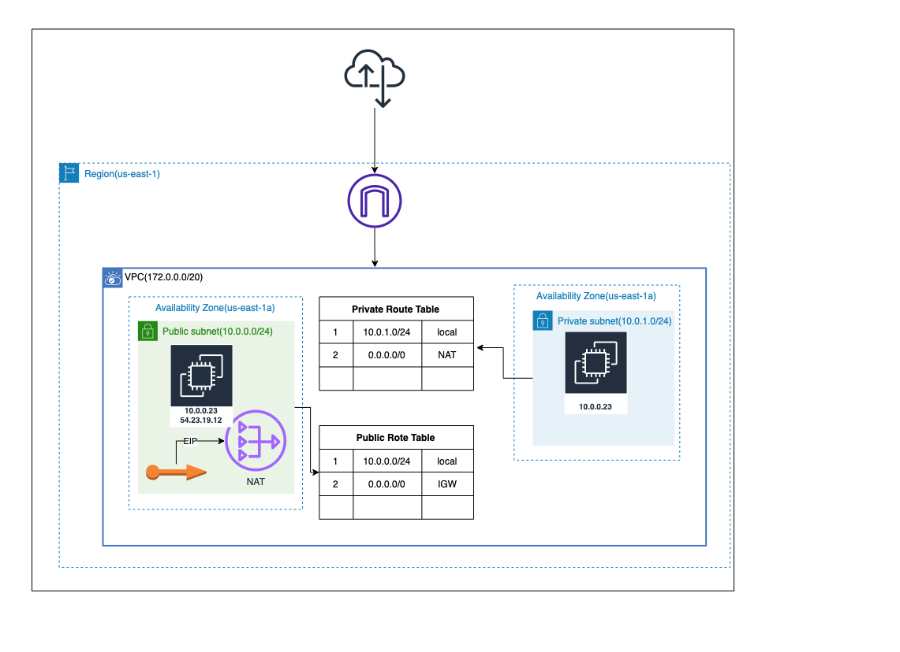

<!-- BEGIN_TF_DOCS -->

## Project: VPC with Single Public Subnet.

### Architecture

## Requirements

| Name                                                         | Version |
| ------------------------------------------------------------ | ------- |
|  [aws](#requirement_aws)       | ~> 3.70 |
|  [local](#requirement_local) | 2.1.0   |
|  [tls](#requirement_tls)       | 3.1.0   |

## Providers

| Name                                                   | Version |
| ------------------------------------------------------ | ------- |
|  [aws](#provider_aws)       | 3.70.0  |
|  [local](#provider_local) | 2.1.0   |
|  [tls](#provider_tls)       | 3.1.0   |

## Modules

No modules.

## Resources

| Name                                                                                                                                                           | Type     |
| -------------------------------------------------------------------------------------------------------------------------------------------------------------- | -------- |
| [aws_eip.eip](https://registry.terraform.io/providers/hashicorp/aws/latest/docs/resources/eip)                                                                 | resource |
| [aws_instance.private_instance](https://registry.terraform.io/providers/hashicorp/aws/latest/docs/resources/instance)                                          | resource |
| [aws_instance.public_instance](https://registry.terraform.io/providers/hashicorp/aws/latest/docs/resources/instance)                                           | resource |
| [aws_internet_gateway.internet_gateway](https://registry.terraform.io/providers/hashicorp/aws/latest/docs/resources/internet_gateway)                          | resource |
| [aws_key_pair.key_pair](https://registry.terraform.io/providers/hashicorp/aws/latest/docs/resources/key_pair)                                                  | resource |
| [aws_nat_gateway.nat_gateway](https://registry.terraform.io/providers/hashicorp/aws/latest/docs/resources/nat_gateway)                                         | resource |
| [aws_route_table.private_route_table](https://registry.terraform.io/providers/hashicorp/aws/latest/docs/resources/route_table)                                 | resource |
| [aws_route_table.public_route_table](https://registry.terraform.io/providers/hashicorp/aws/latest/docs/resources/route_table)                                  | resource |
| [aws_route_table_association.private_route_table_mapping](https://registry.terraform.io/providers/hashicorp/aws/latest/docs/resources/route_table_association) | resource |
| [aws_route_table_association.public_route_table_mapping](https://registry.terraform.io/providers/hashicorp/aws/latest/docs/resources/route_table_association)  | resource |
| [aws_security_group.private_sg](https://registry.terraform.io/providers/hashicorp/aws/latest/docs/resources/security_group)                                    | resource |
| [aws_security_group.public_sg](https://registry.terraform.io/providers/hashicorp/aws/latest/docs/resources/security_group)                                     | resource |
| [aws_subnet.private_subnet](https://registry.terraform.io/providers/hashicorp/aws/latest/docs/resources/subnet)                                                | resource |
| [aws_subnet.public_subnet](https://registry.terraform.io/providers/hashicorp/aws/latest/docs/resources/subnet)                                                 | resource |
| [aws_vpc.vpc](https://registry.terraform.io/providers/hashicorp/aws/latest/docs/resources/vpc)                                                                 | resource |
| [local_file.key](https://registry.terraform.io/providers/hashicorp/local/2.1.0/docs/resources/file)                                                            | resource |
| [tls_private_key.private_key](https://registry.terraform.io/providers/hashicorp/tls/3.1.0/docs/resources/private_key)                                          | resource |

## Inputs

| Name                                                                                       | Description                                                 | Type     | Default                   | Required |
| ------------------------------------------------------------------------------------------ | ----------------------------------------------------------- | -------- | ------------------------- | :------: |
|  [all_traffic](#input_all_traffic)                         | all traffic to public                                       | `string` | `"0.0.0.0/0"`             |    no    |
|  [ami](#input_ami)                                                 | AMI ID for ec2 instance, this value changes for each region | `string` | `"ami-0ed9277fb7eb570c9"` |    no    |
|  [az](#input_az)                                                    | Availability zone for subnet(a,b,c,d,e,f)                   | `string` | `"a"`                     |    no    |
|  [private_subnet_cidr](#input_private_subnet_cidr) | CIDR for private subnet                                     | `string` | `"10.0.1.0/24"`           |    no    |
|  [public_subnet_cidr](#input_public_subnet_cidr)    | CIDR for public subnet                                      | `string` | `"10.0.0.0/24"`           |    no    |
|  [region](#input_region)                                        | AWS region for provider                                     | `string` | `"us-east-1"`             |    no    |
|  [vpc_cidr](#input_vpc_cidr)                                  | VPC CIDR                                                    | `string` | `"10.0.0.0/16"`           |    no    |

## Outputs

| Name                                                              | Description |
| ----------------------------------------------------------------- | ----------- |
|  [private_ip](#output_private_ip) | n/a         |
|  [public_ip](#output_public_ip)    | n/a         |

## Refs

| Name | Description |
| ---- | ----------- |

<!-- END_TF_DOCS -->
